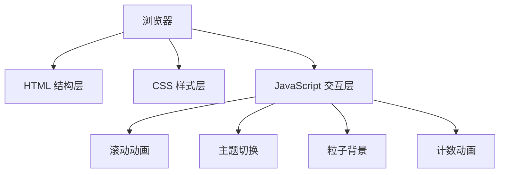

## 1. 架构设计
纯前端静态页面，采用 HTML + CSS + JavaScript 原生实现，无需后端服务，所有数据为静态展示。

## 2. 技术说明
- 前端：HTML5 + CSS3 + 原生 JavaScript (ES6+)
- 无外部框架依赖，纯静态页面
- 字体：Google Fonts (Space Grotesk + Inter)
- 图标：内联 SVG 图标，无图标库依赖
- 部署：可直接托管于任意静态文件服务器

## 3. 文件结构
| 文件 | 用途 |
|-------|---------|
| astrbot.html | 页面主结构，包含所有 HTML 内容 |
| astrbot.css | 样式文件，包含所有 CSS 样式与动画 |
| astrbot.js | 交互脚本，包含动画、主题切换、粒子效果等 |

## 4. 核心功能实现方案

### 4.1 星空粒子背景
- Canvas 绘制动态星空粒子效果
- 粒子随鼠标移动产生视差效果
- 粒子随机大小、透明度、移动速度

### 4.2 滚动动画
- IntersectionObserver API 实现元素进入视口触发动画
- 交错动画延迟，营造层次感
- 渐入 + 上移组合效果

### 4.3 主题切换
- CSS 变量实现明暗主题切换
- localStorage 持久化存储用户偏好
- 系统主题偏好自动检测

### 4.4 数字计数动画
- requestAnimationFrame 实现平滑计数
- 缓动函数优化动画曲线
- 滚动到视口时触发

### 4.5 响应式布局
- CSS Grid + Flexbox 布局
- 媒体查询适配移动端
- 相对单位 (rem/vw) 保证缩放一致性
