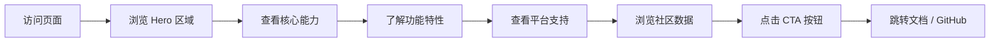

## 1. 产品概述
AstrBot 官方宣传着陆页，展示开源一站式 Agentic 智能助手的核心能力、多平台接入、插件生态与知识库系统，吸引开发者和普通用户了解并部署使用。
- 目标用户：个人开发者、社群运营者、企业团队，寻求可自托管的 AI 助手解决方案
- 产品价值：连接 18+ 主流 IM 平台，1000+ 插件生态，内置 Agent 能力与知识库，All-in-One 开源框架

## 2. 核心功能

### 2.1 功能模块
1. **首页 Hero 区域**：品牌标识、核心定位语、CTA 按钮、动态背景
2. **核心能力展示**：Agentic 基础设施、知识库系统、情感陪伴三大能力板块
3. **功能特性网格**：多模型支持、WebUI 管理、灵活部署、插件生态、MCP/Skills、Agent 能力
4. **多平台接入展示**：展示支持的 18+ 即时通讯平台图标
5. **社区数据展示**：GitHub Stars、周活用户、插件数量、贡献者数量
6. **CTA 行动召唤区**：引导用户快速开始或查看文档
7. **页脚导航**：产品链接、资源链接、社区链接、版权信息

### 2.2 页面详情
| 页面名称 | 模块名称 | 功能描述 |
|-----------|-------------|---------------------|
| 首页 | 导航栏 | 固定顶部，毛玻璃效果，品牌 Logo、导航链接、主题切换按钮 |
| 首页 | Hero 区域 | 大标题渐变文字、副标题、双 CTA 按钮（快速开始/GitHub）、动态粒子/星轨背景 |
| 首页 | 核心能力 | 三大核心板块卡片，含图标、标题、描述、子特性列表，悬停动画 |
| 首页 | 功能特性 | 6 项核心特性网格布局，图标+标题+简介，滚动渐入动画 |
| 首页 | 平台支持 | 平台图标墙，展示 18+ 支持的 IM 平台，悬停发光效果 |
| 首页 | 数据统计 | 四项关键数据大数字展示，带计数动画效果 |
| 首页 | CTA 区域 | 渐变背景，行动召唤文案，主次按钮 |
| 首页 | 页脚 | 品牌介绍、三列导航链接、版权信息、社交链接 |

## 3. 核心流程
用户访问着陆页 → 浏览 Hero 区域了解产品定位 → 向下滚动查看核心能力与功能特性 → 查看平台支持与社区数据 → 点击 CTA 按钮进入文档或 GitHub

## 4. 用户界面设计

### 4.1 设计风格
- **主色调**：深空蓝 (#0f172a) 为底色，配合青蓝渐变 (#06b6d4 → #3b82f6 → #8b5cf6) 作为强调色
- **设计风格**：星际科技感 / 未来主义，深色主题，霓虹发光效果，星空粒子背景
- **按钮风格**：圆角胶囊形，渐变填充，悬停上浮 + 发光效果
- **字体**：标题使用 Space Grotesk 等几何无衬线字体，正文使用 Inter
- **布局风格**：卡片式布局，大留白，居中容器，错落有致的视觉层次
- **图标风格**：线性 SVG 图标，渐变填充，发光效果

### 4.2 页面设计概览
| 页面名称 | 模块名称 | UI 元素 |
|-----------|-------------|-------------|
| 首页 | 导航栏 | 毛玻璃背景、Logo、导航链接、主题切换按钮、平滑过渡 |
| 首页 | Hero 区域 | 大标题渐变文字、动态星空粒子背景、浮动光球、双 CTA 按钮、打字机效果副标题 |
| 首页 | 核心能力 | 三列卡片布局、渐变色图标、悬停上浮、子特性列表、交错动画 |
| 首页 | 功能特性 | 三列网格、发光图标卡片、悬停边框发光、滚动渐入 |
| 首页 | 平台支持 | 图标墙布局、平台 Logo 灰度显示、悬停彩色发光、网格排列 |
| 首页 | 数据统计 | 四列布局、大数字渐变文字、计数动画、标签说明 |
| 首页 | CTA 区域 | 渐变背景遮罩、大标题、双按钮、星点装饰 |
| 首页 | 页脚 | 深色背景、品牌列 + 三列链接、底部版权栏 |

### 4.3 响应式
- 桌面端优先设计，断点 768px 适配移动端
- 移动端：网格从多列转为单列，字体缩放，导航折叠
- 触控优化：按钮最小触控区域 44px，触摸反馈

### 4.4 动效设计
- 页面加载：元素从上到下交错渐入
- 滚动触发：元素进入视口时淡入上移
- 悬停效果：卡片上浮、发光、缩放
- 背景动画：星空粒子漂浮、光球缓慢移动
- 按钮交互：水波纹点击效果
